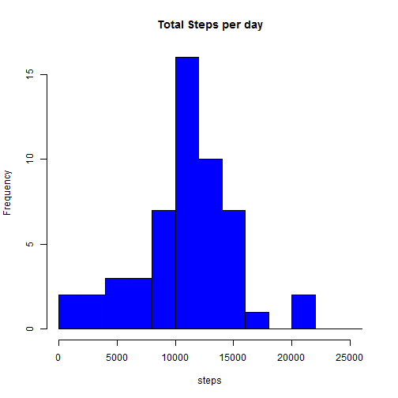
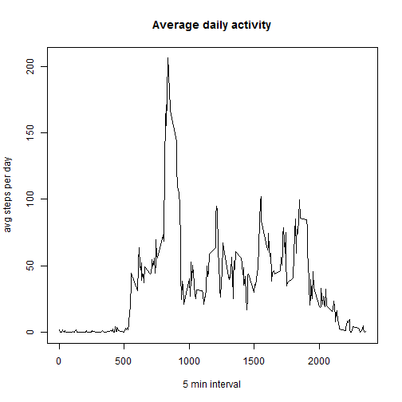
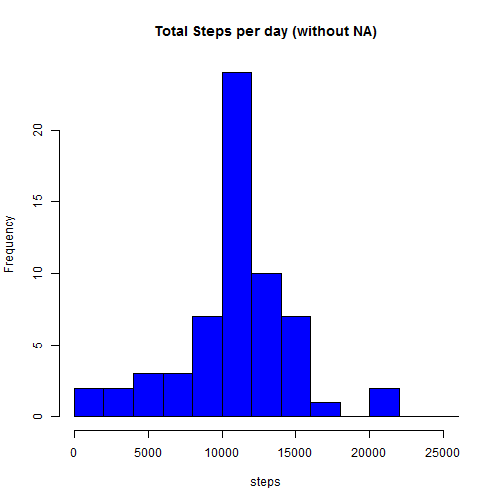
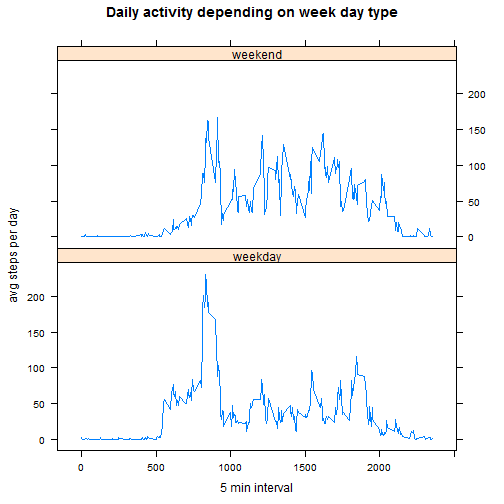

## Overview
This is Peer Assessment 1 for Coursera 'Reproducible Research' class. In this document I wrote a report that answers the questions detailed in assignments.

## Loading and preprocessing the data

First download and load data:

```r
temp <- tempfile()
download.file("http://d396qusza40orc.cloudfront.net/repdata%2Fdata%2Factivity.zip", temp, mode='wb')
data <- read.csv(unz(temp, "activity.csv"))
unlink(temp)
summary(data)
```

```
##      steps                date          interval     
##  Min.   :  0.00   2012-10-01:  288   Min.   :   0.0  
##  1st Qu.:  0.00   2012-10-02:  288   1st Qu.: 588.8  
##  Median :  0.00   2012-10-03:  288   Median :1177.5  
##  Mean   : 37.38   2012-10-04:  288   Mean   :1177.5  
##  3rd Qu.: 12.00   2012-10-05:  288   3rd Qu.:1766.2  
##  Max.   :806.00   2012-10-06:  288   Max.   :2355.0  
##  NA's   :2304     (Other)   :15840
```

## What is mean total number of steps taken per day?

For this part of the assignment I performed next:

- Calculate the total number of steps taken per day:

```r
steps_per_day <- aggregate(steps ~ date, data=data, FUN = sum)
summary(steps_per_day)
```

```
##          date        steps      
##  2012-10-02: 1   Min.   :   41  
##  2012-10-03: 1   1st Qu.: 8841  
##  2012-10-04: 1   Median :10765  
##  2012-10-05: 1   Mean   :10766  
##  2012-10-06: 1   3rd Qu.:13294  
##  2012-10-07: 1   Max.   :21194  
##  (Other)   :47
```

- Made a histogram of the total number of steps taken each day:

```r
hist(steps_per_day$steps, col='blue',breaks=seq(0,26000,2000),
     main = "Total Steps per day", xlab="steps")
```

 

- Calculate and report the mean and median of the total number of steps taken per day:

```r
steps_mean <- mean(steps_per_day$steps)
steps_mean
```

```
## [1] 10766.19
```

```r
steps_median <- median(steps_per_day$steps)
steps_median
```

```
## [1] 10765
```

## What is the average daily activity pattern?

Make a time series plot of the 5-minute interval (x-axis) and the average number of steps taken, averaged across all days (y-axis):

```r
time_series <- aggregate(steps ~ interval, data=data, FUN = mean)
plot(time_series$interval, time_series$steps, type='l',
     main='Average daily activity',
     xlab='5 min interval',
     ylab='avg steps per day')
```

 

5-minute interval, on average across all the days in the dataset, contains the maximum number of steps:

```r
max_interval <- which.max(time_series$steps)
time_series$interval[max_interval]
```

```
## [1] 835
```

## Imputing missing values

Calculate and report the total number of missing values in the dataset:

```r
na_count <- sum(is.na(data))
na_count
```

```
## [1] 2304
```

My strategy for filling in all of the missing values in the dataset:
- get indexes of NA values
- fill them with mean steps value for the same interval

```r
na_idx <- which(is.na(data$steps))
new_data <- data
new_data[na_idx, 'steps'] <- sapply(new_data[na_idx, 'interval'], 
                                function(x){
                                    time_series[time_series$interval==x, 'steps'] 
                                })
summary(new_data)
```

```
##      steps                date          interval     
##  Min.   :  0.00   2012-10-01:  288   Min.   :   0.0  
##  1st Qu.:  0.00   2012-10-02:  288   1st Qu.: 588.8  
##  Median :  0.00   2012-10-03:  288   Median :1177.5  
##  Mean   : 37.38   2012-10-04:  288   Mean   :1177.5  
##  3rd Qu.: 27.00   2012-10-05:  288   3rd Qu.:1766.2  
##  Max.   :806.00   2012-10-06:  288   Max.   :2355.0  
##                   (Other)   :15840
```

Make a histogram of the total number of steps taken each day from new dataset with filled NAs:

```r
steps_per_day_new <- aggregate(steps ~ date, data=new_data, FUN = sum)
hist(steps_per_day_new$steps, col='blue', 
     breaks=seq(0,26000,2000),
     main = "Total Steps per day (without NA)", 
     xlab="steps")
```

 

Calculate and report the mean and median total number of steps taken per day from new dataset with filled NAs:

```r
new_steps_mean <- mean(steps_per_day_new$steps)
new_steps_mean
```

```
## [1] 10766.19
```

```r
new_steps_median <- median(steps_per_day_new$steps)
new_steps_median
```

```
## [1] 10766.19
```

After imputing NA values, mean value hasn't changed, but median changed a bit.  
Hostogram looks almost the same, but distribution is more concentrated at median.

## Are there differences in activity patterns between weekdays and weekends?

Create a new factor variable in the dataset with two levels – “weekday” and “weekend” indicating whether a given date is a weekday or weekend day:

```r
new_data$weekday <- as.factor(weekdays(strptime(new_data$date, format="%Y-%m-%d")))
weekends <- c('Saturday', 'Sunday')
new_data$daytype <- ifelse(new_data$weekday %in% weekends, 'weekend', 'weekday')
head(new_data)
```

```
##       steps       date interval weekday daytype
## 1 1.7169811 2012-10-01        0  Monday weekday
## 2 0.3396226 2012-10-01        5  Monday weekday
## 3 0.1320755 2012-10-01       10  Monday weekday
## 4 0.1509434 2012-10-01       15  Monday weekday
## 5 0.0754717 2012-10-01       20  Monday weekday
## 6 2.0943396 2012-10-01       25  Monday weekday
```

Make a panel plot containing a time series plot of the 5-minute interval (x-axis) and the average number of steps taken, averaged across all weekday days or weekend days (y-axis):

```r
library(lattice)
time_series_new <- aggregate(steps ~ interval + daytype, data=new_data, FUN = mean)
xyplot(steps ~ interval | daytype, data=time_series_new,
       layout=c(1,2), type='l',
       main='Daily activity depending on week day type', 
       xlab='5 min interval', ylab='avg steps per day')
```

 

As we can see from plot above, during weekends number of steps is distributed more uniformly during day intervals, while on weekday we can observe peaks in the morning (8-9 AM) and lower peaks in the evening.
